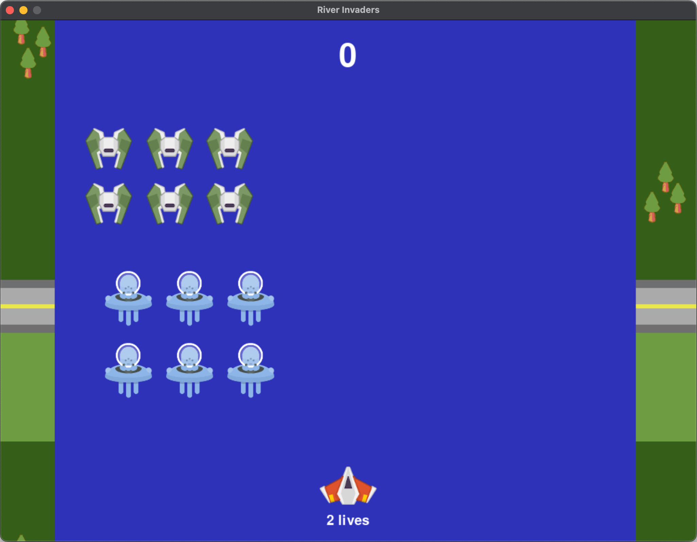

# River Invaders
#### Video Demo:  <URL HERE>
#### Description:  
Implementation of a game inspired on River Raid AND Space Invaders arcade games using Pygame Zero framework.
  
#### Game objective:  
- Make the most points by eliminating enemies. Be careful as you can be destroyed if you touch an enemy or if you step outside the river's edge.  
- With each stage, the difficulty of the game increases.  
- To move the ship use LEFT and RIGHT arrow keys.  
- To increase and reduce speed of the ship use UP and DOWN arrow keys.  
- To fire, press SPACE BAR.  
  
#### Inspiration:  
At first I thought about making the Pong game, which was the first video game I had as a child and using the Pygame language. However, when watching the seminar "Making Small-Scale 2D Games with LÖVE 2D and Lua" where a reference link to the site [Simple Game Tutorials](https://simplegametutorials.github.io) was passed, I saw that there was also mention of Pygame Zero (which I never heard of it before). As I'm looking to evolve in Python, I decided to give Pygame Zero a chance for the appeal of having a faster development than Pygame. I saw some examples and liked it so I decided to follow this line.  
But I realized that it was actually faster to develop with Pygame Zero and so I thought about making another more complex game. I thought about Space Invaders (which I loved too) but for fear of copyright problems, I decided to create something different. As I also liked River Raid, I decided to combine the two and create River Invaders!
  
#### Files and directories explained:  
- Directory */images/*: contains all the images used in the game. The images were extracted from the website [Kenney](https://kenney.nl/) and are not copyrighted, and can be used for personal or commercial use. The only exception is the two background images that were created by me using the Gimp application.
- Directory */sounds/*: audios used in the game. The audios were also obtained from the website Kenney.
- *river-invaders.py* python module: main module that contains 100% of the game's code.
- *requirements.txt* file: dependencies of the game that in fact is reduced only to the library Pygame Zero.
- *screenshot.jpg* image file: game screenshot.
  
#### References used:  
- https://www.youtube.com/watch?v=ynkxX7tsdYo
- https://www.youtube.com/watch?v=zYLA_uO-XH0
- https://simplegametutorials.github.io
- https://pygame-zero.readthedocs.io/en/stable/index.html
- https://www.pygame.org/docs/
  
To run, just clone the repository in terminal and run the following commands:  
`cd river-invaders`  
`python3 -m venv .venv`  
`source .venv/bin/activate`  
`pip install -r requirements.txt`  
`pgzrun river-invaders.py`  
  
If you have problems installing or running Pygame Zero, go to the following links: 
[Installing Pygame Zero](https://pygame-zero.readthedocs.io/en/stable/installation.html)
[Running Pygame Zero in IDLE and other IDEs](https://pygame-zero.readthedocs.io/en/stable/ide-mode.html)  
  
Remember that you need python3 installed on your system before running the above commands.  
    

